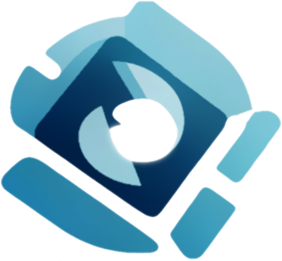

<h1 align="center">
  <a href="https://github.com/MediaEase/MediaEase">
    <!-- Please provide path to your logo here -->
    
  </a>
</h1>

  MediaEase
   
  <a href="#about"><strong>Explore the screenshots »</strong></a>
   
   
  <a href="https://github.com/MediaEase/MediaEase/issues/new?assignees=&labels=bug&template=01_BUG_REPORT.md&title=bug%3A+">Report a Bug</a>
   · 
  <a href="https://github.com/MediaEase/MediaEase/issues/new?assignees=&labels=enhancement&template=02_FEATURE_REQUEST.md&title=feat%3A+">Request a Feature</a>
   · <a href="https://github.com/MediaEase/MediaEase/discussions">Ask a Question</a>

 

|  | |
|---|---|
| **Open&#160;Source** |  |
| **Community** |   |
| **CI/CD** | (coming soon)  |
| **Maintener** |  |
| **Operating Sytem** | Debian 12 (bookworm) |
| **Architecture** | 64 Bits · ARM not supported |
| **Tools** |  |

Table of Contents

- [About](#about)
  - [Built With](#built-with)
- [Getting Started](#getting-started)
  - [Prerequisites](#prerequisites)
  - [Installation](#installation)
- [Usage](#usage)
- [Roadmap](#roadmap)
- [Support](#support)
- [Project assistance](#project-assistance)
- [Contributing](#contributing)
- [Authors \& contributors](#authors--contributors)
- [Security](#security)
- [License](#license)
- [Acknowledgements](#acknowledgements)

---

## About

<table><tr><td>

> **[?]**
> Provide general information about your project here.
> What problem does it (intend to) solve?
> What is the purpose of your project?
> Why did you undertake it?
> You don't have to answer all the questions -- just the ones relevant to your project.

Screenshots

 

> **[?]**
> Please provide your screenshots here.

|                               Home Page                               |                               Login Page                               |
| :-------------------------------------------------------------------: | :--------------------------------------------------------------------: |
|  |  |

</td></tr></table>

### Built With

> **[?]**
> Bash, PHP, Composer, Symfony

## Getting Started

### Prerequisites

> **[?]**
> What are the project requirements/dependencies?

### Installation

> **[?]**
> Describe how to install and get started with the project.

## Usage

> **[?]**
> How does one go about using it?
> Provide various use cases and code examples here.

## Roadmap

See the [open issues](https://github.com/MediaEase/MediaEase/issues) for a list of proposed features (and known issues).

- [Top Feature Requests](https://github.com/MediaEase/MediaEase/issues?q=label%3Aenhancement+is%3Aopen+sort%3Areactions-%2B1-desc) (Add your votes using the 👍 reaction)
- [Top Bugs](https://github.com/MediaEase/MediaEase/issues?q=is%3Aissue+is%3Aopen+label%3Abug+sort%3Areactions-%2B1-desc) (Add your votes using the 👍 reaction)
- [Newest Bugs](https://github.com/MediaEase/MediaEase/issues?q=is%3Aopen+is%3Aissue+label%3Abug)

## Support

> **[?]**
> Provide additional ways to contact the project maintainer/maintainers.

| Documentation              | Status                                                         |
| -------------------------- | -------------------------------------------------------------- |
| :bug: **[User Guides]** | Coming soon |
| :bug: **[Api Reference]** | Coming soon |
| :bug: **[Changelog]** | Coming soon |
| :bug: **[Roadmap]** | [open issues](https://github.com/MediaEase/MediaEase/issues) · [GitHub Discussions](https://github.com/MediaEase/MediaEase/discussions) |
| :bug: **[Available Softwares]** | Coming soon |

## Project assistance

If you want to say **thank you** or/and support active development of MediaEase:

- Add a [GitHub Star](https://github.com/MediaEase/MediaEase) to the project.
- Tweet about the MediaEase.
- Write interesting articles about the project on [Dev.to](https://dev.to/), [Medium](https://medium.com/) or your personal blog.

Together, we can make MediaEase **better**!

## Contributing

First off, thanks for taking the time to contribute! Contributions are what make the open-source community such an amazing place to learn, inspire, and create. Any contributions you make will benefit everybody else and are **greatly appreciated**.

Please read [our contribution guidelines](docs/CONTRIBUTING.md), and thank you for being involved!

## Authors & contributors

The original setup of this repository is by [MediaEase](https://github.com/MediaEase).

For a full list of all authors and contributors, see [the contributors page](docs/CONTRIBUTORS.md).

## Security

MediaEase follows good practices of security, but 100% security cannot be assured.
MediaEase is provided **"as is"** without any **warranty**. Use at your own risk.

_For more information and to report security issues, please refer to our [security documentation](docs/SECURITY.md)._

## License

This project is licensed under the **BSD license**.

See [LICENSE](LICENSE) for more information.

## Acknowledgements

> **[?]**
> None Yet
